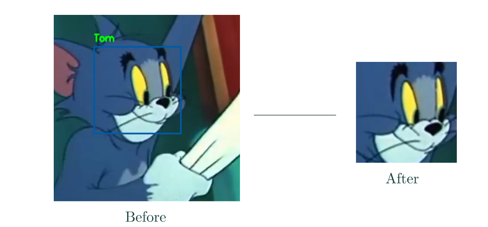

# Tom_And_Jerry_Emotion_Detectioin

There is no one around the world who doesn’t know of the animated comedy series, Tom and Jerry. Let’s admit it—all of us still love the iconic show and wish to catch a glimpse of Tom’s and Jerry’s constant notorious banter. Jerry leaves no stone unturned to annoy Tom—be it getting Tom in trouble with his landlady Mammy Two Shoes and his arch-nemesis Spike, making a fool out of him in front of his love interest Toodles Galore, or beating him for bothering Nibbles or Quaker. No matter what, we always end up laughing till our stomachs hurt.

In this project, i have build a model that detects emotions of the characters in a video frame from our most-loved show, Tom and Jerry. 

I have extract frames from a video clip provided and classify the primary character’s emotion into one of the five classes: angry, happy, sad, surprised, or Unknown.

### Dataset

The dataset consists of two parameters—‘Frame_ID’ that indicates the frame of the video and ‘Emotion’ that categorizes the emotion of the primary character into different labels: angry, happy, sad, surprised, or Unknown.

